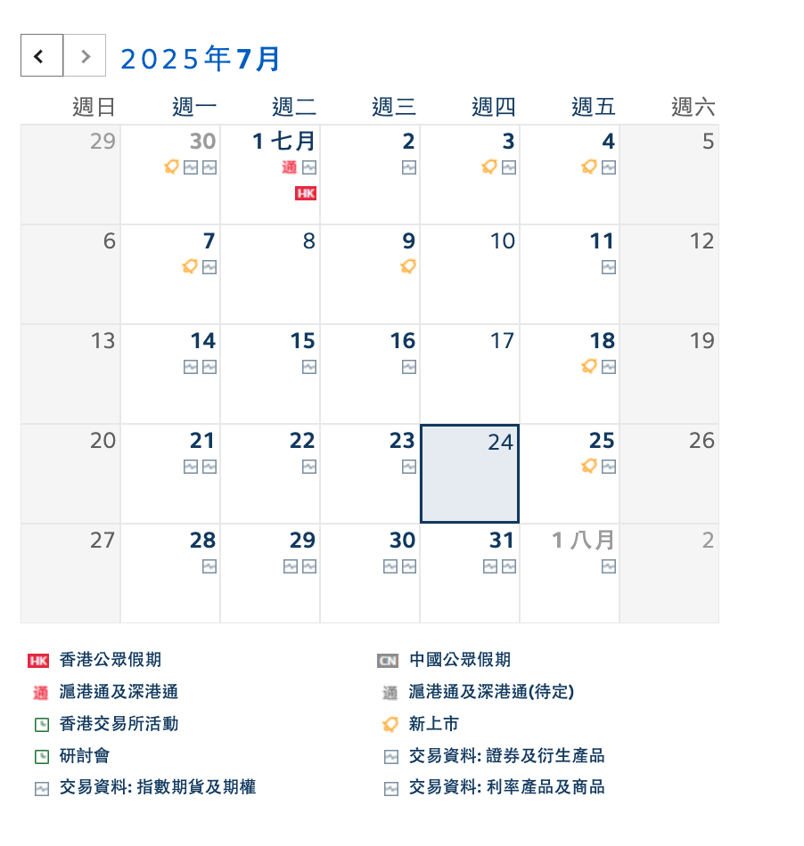

# 描述

对源订阅日历，提供关键词过滤。

通常我们订阅一个公共日历，会包含很多事件，如果我们只关心其中的某些事件，可以使用这个程序，在URL中提供关键词进行过滤。

比如香港交易所（HKEX）提供的日历订阅：<https://www.hkex.com.hk/News/HKEX-Calendar?sc_lang=zh-HK>

尽管我只关心「新上市」的事件，但不得不订阅整个日历。通过这个程序，提供关心事件的关键词，就可以得到一个仅仅包含自己关心事件的日历了。

## 示例

**港股新上市**

<http://localhost:8000/custom.ics?keywords=新上市>

**Starlink火箭发射事件**

1. 设置源订阅日历（全球火箭发射事件）

   `export ORIGINAL_ICAL_URL='<https://calendar.google.com/calendar/ical/nextspaceflight.com_l328q9n2alm03mdukb05504c44%40group.calendar.google.com/public/basic.ics'`
2. <http://localhost:8000/custom.ics?keywords=starlink>

你可以在连接后添加`debug=true`，直接在浏览器中查看过滤后的日历数据，而不会直接下载。

<http://localhost:8000/custom.ics?keywords=starlink&debug=true>

## 环境变量配置

`ORIGINAL_ICAL_URL`：源日历订阅地址

默认值（香港交易所）：<https://www.hkex.com.hk/News/HKEX-Calendar/Subscribe-Calendar?sc_lang=zh-CN>

`X_WR_CALNAME`：新日历名称

默认值（港股IPO日历）
